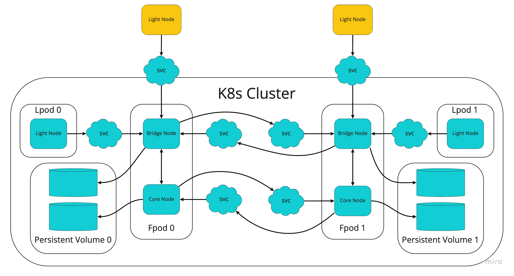
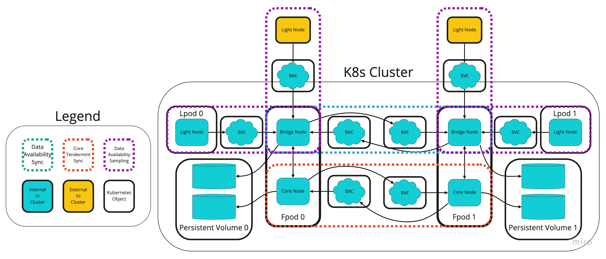

# Infrastructure Plan
---

## Repos

### Celestia-Node

Results in a `celestia-node` binary.

### Celestia-App

Imports `celestia-core` library. Results in a `celestia-appd` binary.

### Celestia-Core

Library imported by `celestia-appd`.

### Optimint

TBD

---
## Continuous Integration

Build and test on every PR merged to `main` branch of all repositories.  
Runs unit tests and in-memory binary scoped integration tests.

---
## Continuous Deployment

### Release Candidate 0 (RC0)

Automatically updated every hour.

A new genesis block is created on every update.

### Release Candidate 0 (RC1)

Automatically updated every 12 hours.

The chain state is preserved between updates.

### Devnet

A PR is automatically created every 24 hours. Upon approval and merging the cluster is updated.

The chain state is preserved between updates.

---
## Kubernetes Clusters

We propose creating 3 distinct kubernetes clusters: Release Candidate 0 (RC0), Release Candidate 1 (RC1), and Devnet. Promotion of deployments only goes in one direction: `RC0 -> RC1 -> Devnet`.

Each cluster is created with the Miminum Viable Cluster (MVC) configuration.

### Minimum Viable Cluster (MVC)

#### Full Pod Deployment(s)
2 `Deployments` of 1 `Pod` consisting of:
- 1 `celestia-app` container with embedded `celestia-core`
- 1 `celestia-node` container run as a bridge node which communicates the `celestia-app` container on the `Pod`'s `localhost` network.

#### Light Pod Deployment(s)
2 `Deployments` of 1 `Pod` consisting of:
- 1 `celestia-node` container run as a light node which performs data availability sampling by communicating with the bridge node through an internal Kubernetes `Service`.

#### Services
3 `Service`s for each Full Pod Deployment which expose:
- Port `123` to containers within the Kubernetes cluster
- Port `456` to containers within the Kubernetes cluster
- Port `123` to actors outside the Kubernetes cluster through a loadbalancer

#### Minimum Viable Cluster

#### Minimum Viable Cluster w/ Logical Groupings

